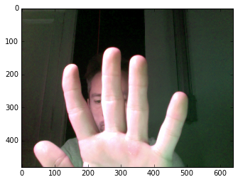
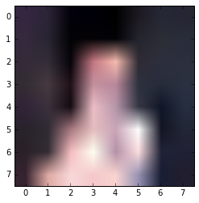
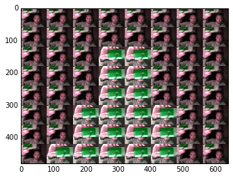
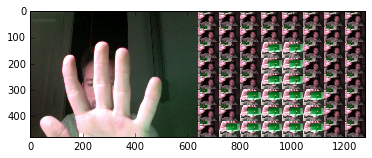

# What is happening here?
Good question.

Here I will try to explain.

The simple idea is to divide an image in sub-regions (I call them cell) having each the same size ration as the original image. 

Each cell being replaced by a miniature version of the whole image. I save some images when the program is running. The images chosen to replace each cell area are selected according to the closest **RGB** value cell area Vs the saved images.

From that point already you can probably point out several challenges I will have to solve:

+ real time processing
+ size of the cells
+ **RGB** metric or in other color space to use
+ update the database of images
+ maintain a fast enough webcam video stream

# Let's jump into the watter
Below I will show image examples to illustrate the mosaic effect on a single frame.


```python
import cv2
import numpy as np
import matplotlib.pyplot as plt
from pixelMirrorToolboox import toolboox
import glob
import os
%matplotlib inline
import time
```

## Load the last frame grabbed by the camera
In the program, each frame is saved in order to be added later to the database. 


```python
path_to_database = "/frame_db"
frame = cv2.imread("./"+path_to_database+"/new_frame.png")
print np.shape(frame)
plt.imshow(frame[:,:,[2,0,1]]) # I need to change the index because cv2 loads images as BGR instead of RGB.
path_database = path_to_image
```

    (480, 640, 3)





```python
number_row = 8
frame_scaled = cv2.resize(frame, (number_row, number_row)) 
plt.imshow(frame_scaled[:,:,[2,1,0]])
```


    <matplotlib.image.AxesImage at 0x115d923d0>





## Prepare the database of image
Here we analyze the series of images that constitute the database.


```python
frame_mosaic = cv2.imread("./"+path_to_database+"/new_mosaic.png")
print np.shape(frame_mosaic)
plt.imshow(frame_mosaic[:,:,[2,0,1]]) # I need to change the index because cv2 loads images as BGR instead of RGB.
```

    (480, 640, 3)


    <matplotlib.image.AxesImage at 0x115ee8390>





```python
plt.imshow(np.hstack([frame[:,:,[2,0,1]], frame_mosaic[:,:,[2,0,1]]]))
```


    <matplotlib.image.AxesImage at 0x119670f50>





# What is not happening here?
Again this is a good question.

Having something running is nice but several points need to be improve:

+ the update of the image database is not optimal. If the nothing is really changing in the webcam field of view then the database of image is more and more uniform and number of different values is actually reducing pretty fast. As the result the mosaic will display everywhere the same image.
+ I need a tools to see and investigate the color information in my image lut in order to populate the LUT more clerverly.
